# Telegram Manager


**Dashboard full-stack** quản lý tài khoản Telegram qua web UI + REST API — **FastAPI**, **Telethon**, **React**, **PostgreSQL / SQLite**.

🔗 **Repo:** [github.com/bacnguyen2004/telegram-manager](https://github.com/bacnguyen2004/telegram-manager)

---

## Tổng quan

Monorepo: backend MTProto (Telethon) + frontend React. Một dashboard để:

- Thêm / quản lý file `.session` (OTP, 2FA)
- Gán **proxy** SOCKS5 / HTTP / MTProto theo account
- Join/leave nhóm, quét danh sách
- Chat: đọc/gửi, media, reaction, poll, pin, forward
- **Tác vụ hàng loạt** multi-acc
- **Hội thoại** — lập kịch bản AI multi-acc, chạy job gửi group (Start / Dừng / Tiếp tục)
- **Nhật ký hoạt động** khi bật database

```
telegram-manager/
├── backend/          # FastAPI + Telethon · :8001
├── frontend/         # React + Vite · :5173 (proxy /api)
├── docs/screenshots/ # Ảnh README
└── docker-compose.yml
```

| | |
|--|--|
| API | ~70+ REST · envelope `{ success, data, error }` |
| OpenAPI | http://127.0.0.1:8001/docs |
| UI product | **Hội thoại** = `/conversation` |
| Code / API module | `campaign` · `/api/campaign/*` |

---

## Điểm nổi bật

- **Session lock 2 lớp** (`asyncio` + file lock) — an toàn multi-request / multi-worker
- **Proxy per session** — pool, gán, chia đều, test TCP
- **Chat workspace** — pagination, unread, mark-read, media, reaction, poll
- **Hội thoại (campaign)** — AI plan crypto chat, timeline `at_sec`, job start/stop/resume, draft localStorage
- **Metadata DB** — sessions, proxies, roster, audit, campaign jobs
- Docker Compose full-stack · CI (pytest + vitest + build) · light/dark theme

### Tech stack

| Layer | Công nghệ |
|-------|-----------|
| Backend | Python 3.11 · FastAPI · Telethon · SQLModel · Alembic · OpenAI SDK |
| Frontend | React 19 · TypeScript · Vite · React Router |
| Database | PostgreSQL 16 (Docker) · SQLite (dev local) |
| DevOps | Docker Compose · nginx · GitHub Actions |
| Tests | pytest · vitest |

---

## Screenshots

> Click ảnh trên GitHub để xem lớn. Cập nhật ảnh: [`docs/screenshots/README.md`](docs/screenshots/README.md)

### Quản lý tài khoản

| Tổng quan | Tài khoản |
|:---------:|:---------:|
| 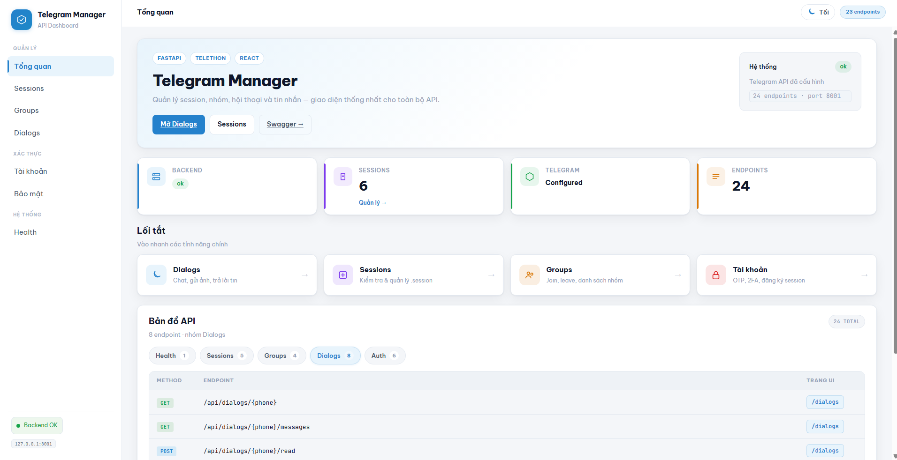 | 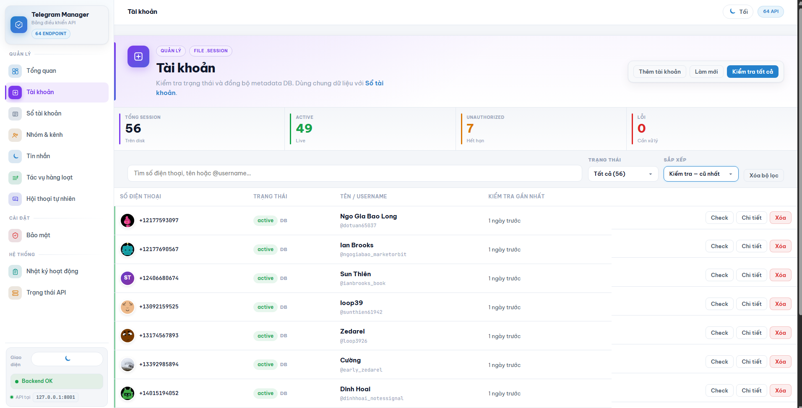 |
| **Tổng quan** · `/` | **Tài khoản** · `/sessions` |

| Sổ tài khoản | Proxy |
|:------------:|:-----:|
| 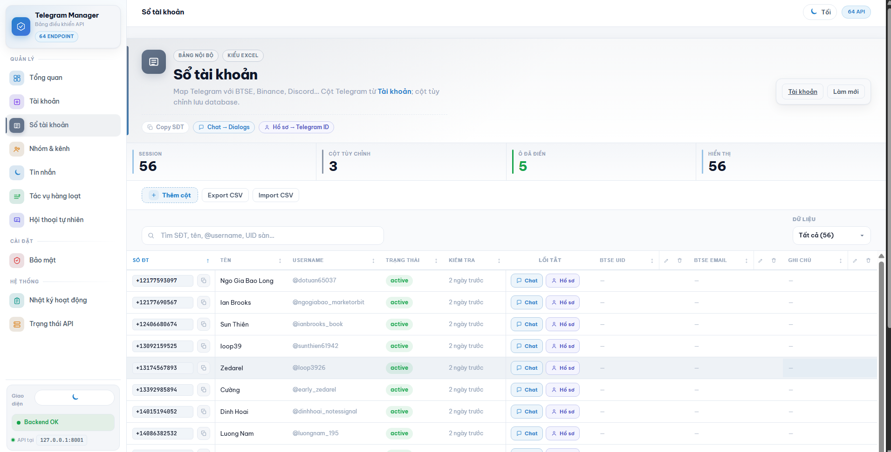 | 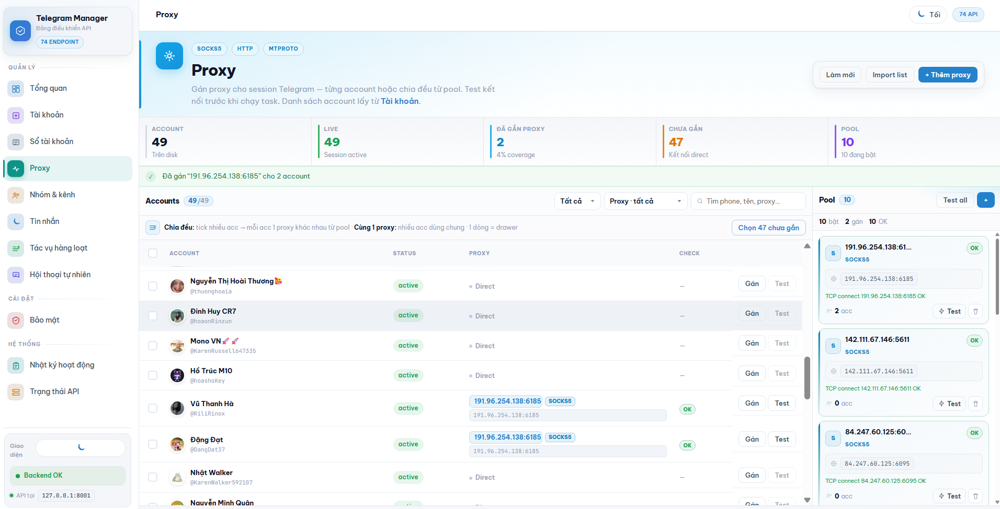 |
| **Sổ tài khoản** · `/roster` | **Proxy** · `/proxy` |

### Chat, nhóm & automation

| Tin nhắn | Nhóm & kênh |
|:--------:|:-----------:|
| 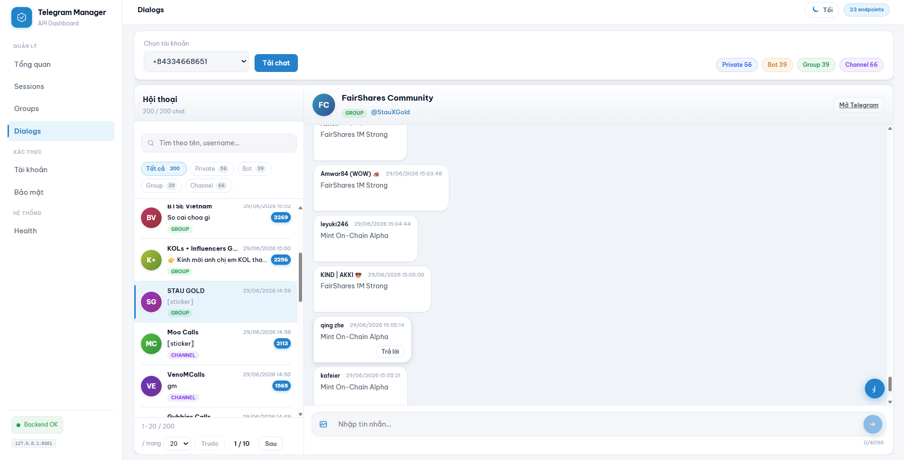 | 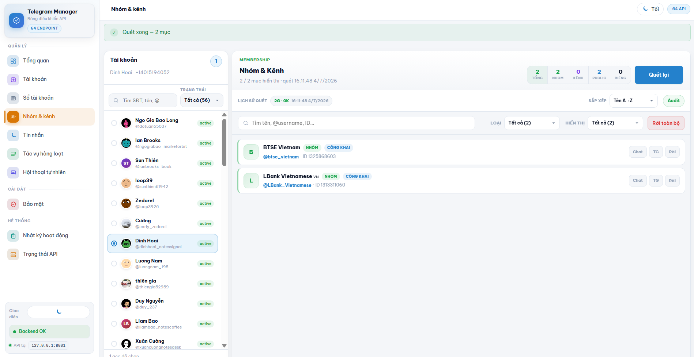 |
| **Tin nhắn** · `/dialogs` | **Nhóm & kênh** · `/groups` |

| Tác vụ hàng loạt | Hội thoại |
|:----------------:|:---------:|
| 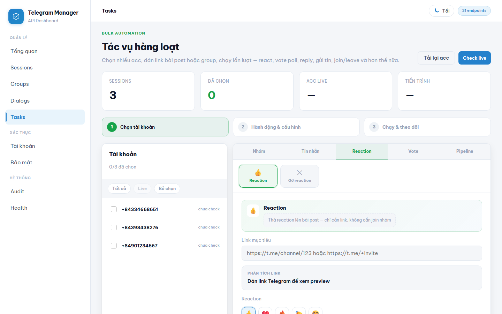 | 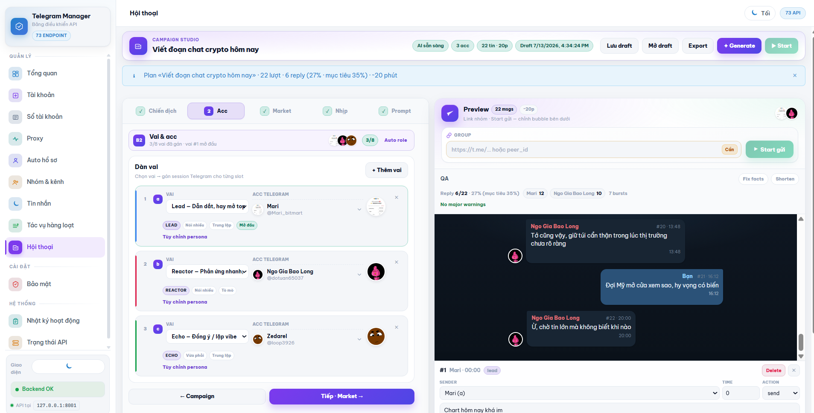 |
| **Tác vụ** · `/tasks` | **Hội thoại** · `/conversation` |

### Bảo mật & hệ thống

| Bảo mật | Nhật ký |
|:-------:|:-------:|
| 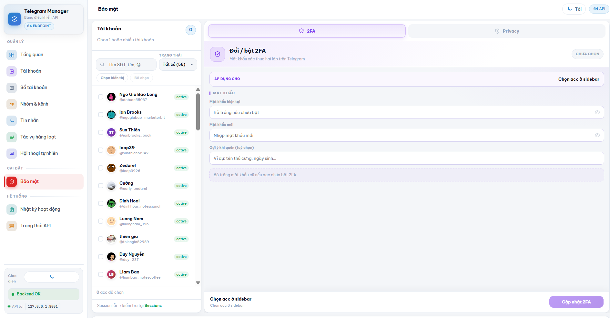 | 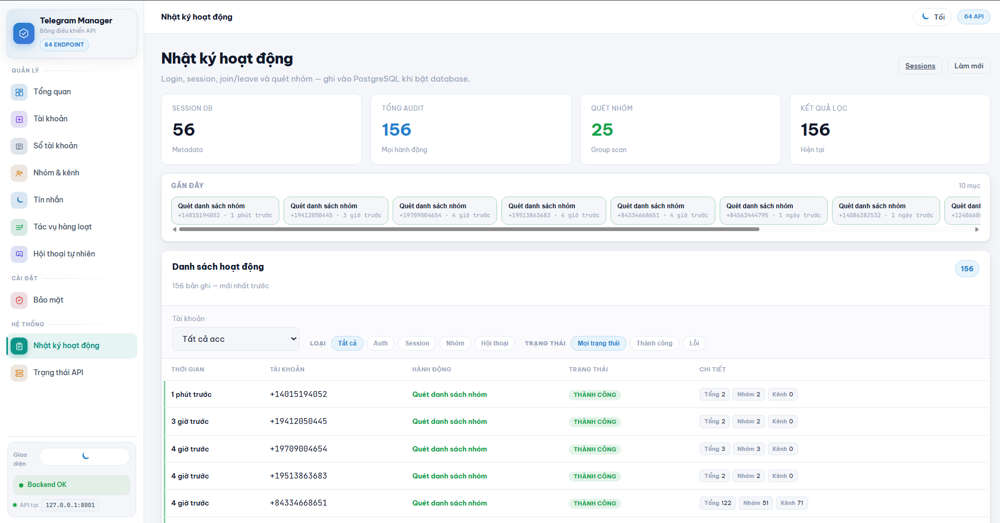 |
| **Bảo mật** · `/security` | **Nhật ký** · `/audit` |

| Trạng thái API |
|:--------------:|
| 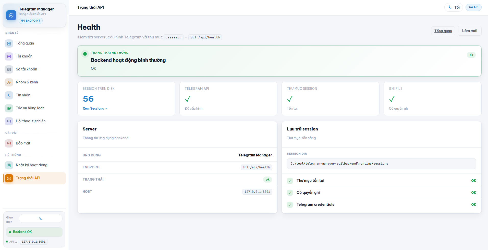 |
| **Health** · `/health` |

---

## Quick start (Docker)

**Cần:** Docker · `TELEGRAM_API_ID` + `TELEGRAM_API_HASH` từ [my.telegram.org](https://my.telegram.org)

```powershell
# Repo root
copy backend\.env.example backend\.env
# Điền TELEGRAM_API_ID + TELEGRAM_API_HASH
# (Tuỳ chọn) AI_ENABLED + OPENAI_API_KEY cho Hội thoại

docker compose up --build
```

| Service | URL |
|---------|-----|
| Dashboard | http://localhost:5173 |
| Swagger | http://127.0.0.1:8001/docs |
| Health | http://127.0.0.1:8001/api/health |

### Thêm tài khoản

1. http://localhost:5173/sessions?add=1  
2. SĐT → OTP → (2FA nếu có)  
3. Kiểm tra session tại **Tài khoản**  
4. (Tuỳ chọn) **Proxy** — import pool, gán / chia đều  

> Login Telegram trên điện thoại **không** tạo session cho API này.

---

## Tính năng dashboard

| Trang | Route | Mô tả |
|-------|-------|-------|
| Tổng quan | `/` | Stats, lối tắt, bản đồ API |
| Tài khoản | `/sessions` | Session, check live, avatar, profile |
| Sổ tài khoản | `/roster` | Bảng cột tùy chỉnh, import CSV |
| Proxy | `/proxy` | Pool SOCKS5/HTTP/MTProto, gán, test |
| Auto hồ sơ | `/auto-profile` | Random profile / avatar hàng loạt |
| Nhóm & kênh | `/groups` | Join / leave / quét |
| Tin nhắn | `/dialogs` | Chat UI đầy đủ |
| Tác vụ hàng loạt | `/tasks` | Pipeline multi-acc |
| **Hội thoại** | `/conversation` | AI plan + job gửi group (`/campaign` → redirect) |
| Bảo mật | `/security` | 2FA, privacy invite |
| Nhật ký | `/audit` | Audit log, group scans |
| Health | `/health` | Backend, TG config, DB |

### Hội thoại (campaign) — tóm tắt

UI **Hội thoại** · code module **`campaign`**.

```
Setup (goal, acc, market, thời lượng)
  → Generate plan (OpenAI)
  → Preview chat + timeline
  → Start gửi group · Dừng · Tiếp tục
```

| Khả năng | Chi tiết |
|----------|----------|
| AI plan | Multi-acc chat crypto, `duration_min` + `target_lines` |
| Timeline | `at_sec` · fit vào khung thời lượng · preview trạng thái gửi |
| Job | `POST /api/campaign/jobs` · stop · resume |
| Draft | Auto-lưu + **Lưu / Mở draft** (localStorage trình duyệt) |
| Model | Ô nhập model id · link [OpenAI Pricing](https://platform.openai.com/docs/pricing) |

Chi tiết: [`docs/conversation.md`](docs/conversation.md)

---

## Kiến trúc

### Backend

```
backend/app/
├── main.py                 # Lifespan, mount /api
├── config.py               # Settings từ .env
├── db/                     # SQLModel, proxy, roster, metadata
├── routers/                # HTTP thin adapters
├── schemas/                # Pydantic
├── services/
│   ├── telegram/           # Client pool, dialogs, groups, auth…
│   ├── market/             # CoinGecko + news (grounding AI)
│   ├── ai/                 # OpenAI chat helper
│   └── campaign/           # Hội thoại: planner, workflow, execution/
│       ├── planner.py      # Generate plan
│       ├── prompts.py      # LLM prompts
│       ├── normalize.py    # Plan → script, fit timeline
│       ├── workflow.py     # Orchestration API
│       └── execution/      # Runner + job store (gửi tin thật)
└── utils/                  # Session lock, responses
```

### Session lock

| Lớp | Phạm vi |
|-----|---------|
| `asyncio.Lock` | Cùng process |
| File `runtime/locks/{phone}.lock` | Nhiều process / worker |

### Naming: Hội thoại vs campaign

| Mặt | Tên |
|-----|-----|
| Menu / URL | Hội thoại · `/conversation` |
| API / Python package / DB | `campaign` · `/api/campaign/*` · `campaign_jobs` |

Cùng một feature — product name vs technical module name.

---

## API

Mọi response: `{ "success": true|false, "data": ..., "error": null|"..." }`

<details>
<summary><strong>Health (1)</strong></summary>

| Method | Path |
|--------|------|
| GET | `/api/health` |

</details>

<details>
<summary><strong>Sessions (11)</strong></summary>

| Method | Path |
|--------|------|
| GET | `/api/sessions` |
| POST | `/api/sessions/check` |
| GET/DELETE | `/api/sessions/{phone}` |
| GET | `/api/sessions/{phone}/me` |
| GET/POST/DELETE | `/api/sessions/{phone}/avatar` |
| PATCH | `/api/sessions/{phone}/profile` |
| GET/DELETE | `/api/sessions/{phone}/authorizations…` |

</details>

<details>
<summary><strong>Roster (6) · Proxy (9) · Groups (4)</strong></summary>

Xem OpenAPI `/docs` hoặc `frontend/src/utils/apiMap.ts`.

</details>

<details>
<summary><strong>Dialogs & messages</strong></summary>

Dialogs: list, messages, search, stream, pin, media, mark-read.  
Messages: send, reply, media, forward, edit, delete, pin, react, poll/vote.

</details>

<details>
<summary><strong>Hội thoại / Campaign (7)</strong></summary>

| Method | Path | Việc |
|--------|------|------|
| GET | `/api/campaign/ai-status` | AI config + model gợi ý + link pricing |
| GET | `/api/campaign/market` | Snapshot giá / news |
| POST | `/api/campaign/plan` | Generate plan |
| POST | `/api/campaign/jobs` | Start job |
| GET | `/api/campaign/jobs/{id}` | Trạng thái / line_results |
| POST | `/api/campaign/jobs/{id}/stop` | Dừng |
| POST | `/api/campaign/jobs/{id}/resume` | Tiếp tục |

</details>

<details>
<summary><strong>Auto profile (2) · Metadata (4) · Auth (5)</strong></summary>

| | |
|--|--|
| Auto profile | `POST /api/auto-profile/preview` · `apply` |
| Metadata | overview, audit, group-scans, sessions |
| Auth | send-code, login, register, 2fa, privacy |

</details>

Bản đồ UI ↔ API: dashboard `/` và `frontend/src/utils/apiMap.ts`.

---

## Dev local

### Backend

```powershell
cd backend
python -m venv venv
.\venv\Scripts\activate
pip install -r requirements.txt
copy .env.example .env
# Điền TELEGRAM_* · (tuỳ chọn) AI_*
uvicorn app.main:app --reload --host 127.0.0.1 --port 8001
```

### Frontend

```powershell
cd frontend
npm install
npm run dev
```

Proxy `/api` → `http://127.0.0.1:8001`  
Đổi target: `frontend/.env.local` → `VITE_API_PROXY_TARGET=...`

### Tests

```powershell
# Backend
cd backend
pip install -r requirements-dev.txt
python -m pytest

# Frontend
cd frontend
npm ci
npm run test
npm run build
```

CI: pytest + vitest + build trên push/PR `main`.

---

## Biến môi trường

Sao chép `backend/.env.example` → `backend/.env`.

### Bắt buộc

| Biến | Mô tả |
|------|--------|
| `TELEGRAM_API_ID` | [my.telegram.org](https://my.telegram.org) |
| `TELEGRAM_API_HASH` | API hash |

### Session & lock

| Biến | Mặc định |
|------|----------|
| `SESSION_FOLDER` / `SESSION_DIR` | `runtime/sessions` |
| `SESSION_LOCK_DIR` | `runtime/locks` |
| `TG_SESSION_LOCK_TIMEOUT` | `120` |
| `TG_SESSION_LOCK_STALE_SECONDS` | `300` |

### Database

| Biến | Mặc định |
|------|----------|
| `DATABASE_URL` | SQLite `runtime/telegram_manager.db` |
| `DATABASE_ENABLED` | `true` |

Proxy pool / audit / roster / campaign jobs **cần DB**. Docker Compose inject Postgres cho service `api`.

### AI (Hội thoại)

| Biến | Mặc định | Mô tả |
|------|----------|--------|
| `AI_ENABLED` | `false` | Bật generate plan |
| `OPENAI_API_KEY` | — | API key |
| `OPENAI_MODEL` | `gpt-4.1-mini` | Model mặc định |
| `OPENAI_MODELS` | (trống) | Gợi ý UI (csv) |
| `OPENAI_TEMPERATURE` | `0.9` | |
| `OPENAI_MAX_OUTPUT_TOKENS` | `4000` | |
| `OPENAI_TIMEOUT_SECONDS` | `120` | |

Giá model: xem [OpenAI Pricing](https://platform.openai.com/docs/pricing) (không hardcode trong app).

### Realtime (tuỳ chọn)

| Biến | Gợi ý |
|------|--------|
| `TELEGRAM_REALTIME_MODE` | `polling` · `event` · `hybrid` |
| `TELEGRAM_LISTENER_ENABLED` | legacy bật listener |
| `TELEGRAM_CLIENT_IDLE_SECONDS` | giữ TCP ấm (campaign) |

---

## Docker services

```powershell
docker compose up --build
docker compose up -d
docker compose down
```

| Service | Port | Mô tả |
|---------|------|--------|
| `web` | 5173 | nginx + React build |
| `api` | 8001 | FastAPI |
| `db` | 5433→5432 | PostgreSQL |

Volumes: `telegram-sessions`, `telegram-locks`, `postgres-data`.

---

## Cấu trúc repo (gợi ý)

| Path | Vai trò |
|------|---------|
| `backend/app/` | Source API |
| `backend/tests/` | pytest |
| `backend/runtime/` | sessions, locks, DB local (**gitignore**) |
| `frontend/src/` | UI |
| `docs/screenshots/` | Ảnh README |
| `docs/conversation.md` | Hướng dẫn Hội thoại |
| `mcps/` | Schema MCP local agent — **không** thuộc runtime app |

---

## License & author

[bacnguyen2004](https://github.com/bacnguyen2004)

Portfolio: full-stack · REST · Telegram/MTProto · multi-acc proxy · AI campaign jobs · Docker · automated tests.
